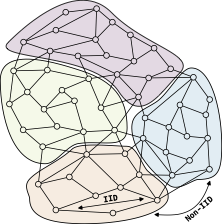
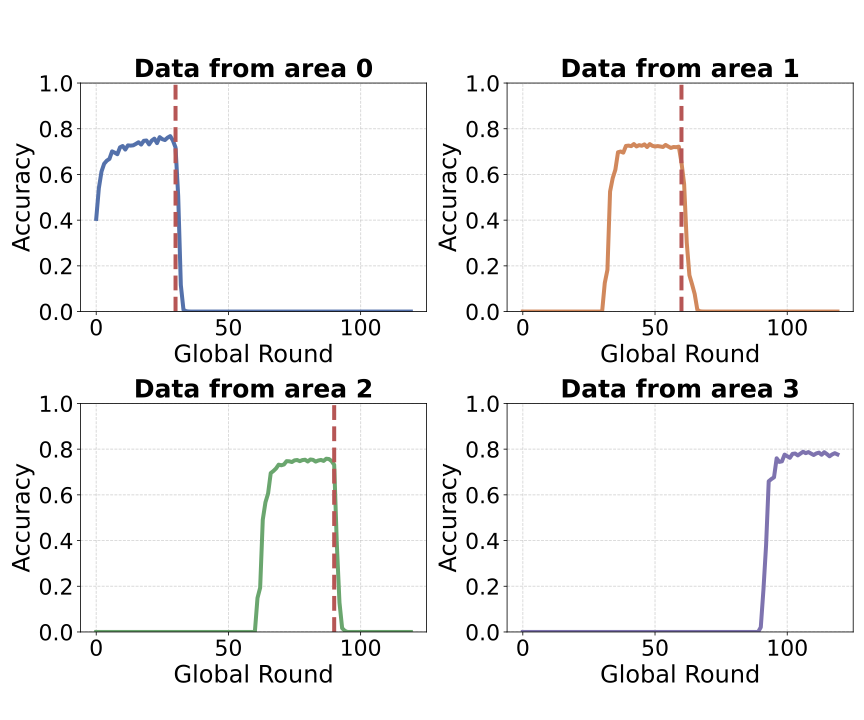
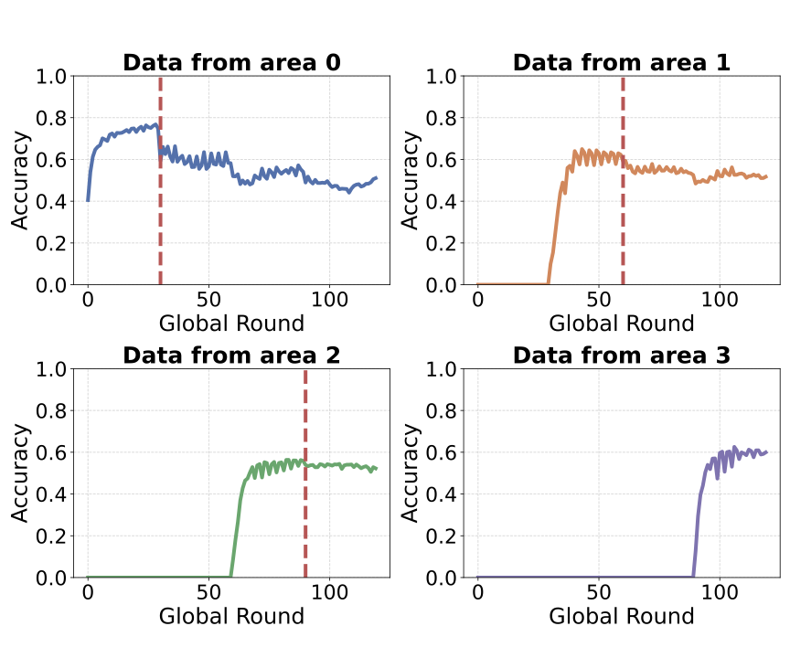
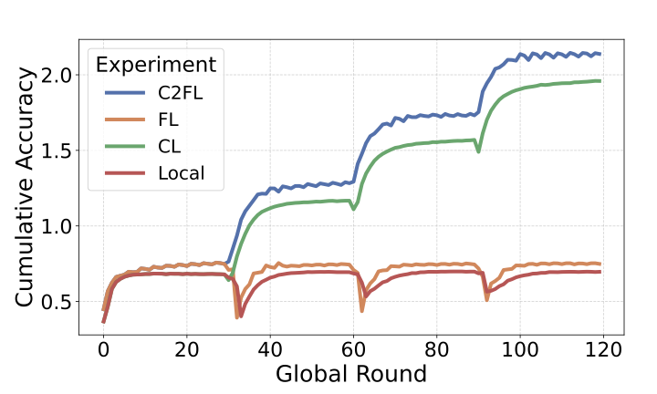

  
ACSOS 2026 · 7th IEEE International Conference on Autonomic Computing and Self-Organizing Systems

  <h1 class="cover-paper-title">C²FL: Clustered Continual Federated Learning</h1>
  <h2 class="cover-subtitle">Under Spatial and Temporal Drift</h2>
  

  

    

      <strong style="color: var(--deck-orange);">Davide Domini</strong> 
      · 
      Gianluca Aguzzi 
      · 
      Lorenzo Pellegrini 
      · 
      Mirko Viroli 
      · 
      Lukas Esterle 
    

  

  

      

        
        

          Department of Computer Science and Engineering, 
          University of Bologna, Cesena, Italy
        

      

      

        
        

          Department of Electrical and Computer Engineering, 
          Aarhus University, Aarhus, Denmark
        

      

  

---
layout: default
class: c2-viz-slide
---

# Intelligence is moving to the edge

Devices in collective systems continuously sense their surroundings and adapt their behavior locally.

<ul class="c2-clean-list">
  <li><strong>Connected vehicles</strong> learn from traffic conditions</li>
  <li v-click="1"><strong>Drone swarms</strong> learn from the areas they monitor</li>
  <li v-click="2"><strong>Participatory sensing</strong> learns from personal devices</li>
</ul>

  The systems question
  How can devices learn collectively when observations cannot be centralized?

<C2EdgeScenario :click="$clicks" />

<!-- [Sources]
Context and motivating domains: supplied C²FL paper, Introduction.
-->

---
layout: default
class: c2-stage-slide
---

# Federated learning keeps observations local

> A distributed learning paradigm where devices collaboratively train a model without sharing their raw data.

<FederatedLearning :click="$clicks" />

The promise: <strong>collective learning</strong> without centralized data collection.

<Cites refs="1" />

<!-- [Sources]
Federated learning process: supplied C²FL paper, Section II-A.
-->

---
layout: default
class: c2-viz-slide
---

# One global model may fit no region well

- Nearby devices often sense **similar phenomena**.
- Distant devices may experience **radically different conditions**.
- Their local updates therefore optimize **different objectives**.

  <strong>Proximity-based non-IID data:</strong> distributions are approximately homogeneous <em>within</em> a region, but heterogeneous <em>across</em> regions.

  <strong>Structure matters:</strong> heterogeneity follows the physical environment—it is not random across clients.

<C2SpatialMap :click="$clicks" mode="heterogeneity" />

<!-- [Sources]
Spatially structured heterogeneity: supplied C²FL paper, Figure 1 and Sections I–II-A.
-->

---
layout: default
class: c2-stage-slide
---

# Clustered FL specializes models by region

> Devices exposed to similar distributions collaborate on one model per cluster instead of being forced into a single global average.

<C2SpatialMap :click="$clicks" mode="clustered" />

  
<strong>Local specialization</strong>One model follows the conditions of one region.

  
<strong>Self-organization</strong>Clusters can emerge from local interactions.

  
<strong>The catch</strong>Existing results mainly assume static membership.

<Cites refs="3,4,5" />

<!-- [Sources]
Clustered FL and self-organizing spatial clusters: supplied C²FL paper, Sections I and II-A.
-->

---
layout: default
class: c2-stage-slide
---

# Mobility turns spatial drift into temporal drift

<C2MobilityDrift :click="$clicks" />

  Can a device adapt to the current region without forgetting the previous ones?

The failure modeTraining on the current region can overwrite previously acquired knowledge: <strong>catastrophic forgetting</strong>.

<!-- [Sources]
Mobility-induced temporal drift and catastrophic forgetting: supplied C²FL paper, Sections I and III-D.
-->

---
layout: default
class: c2-stage-slide
---

# Continual learning adds memory across regions

> Continual learning enables a model to acquire new knowledge while preserving previously learned capabilities.

<C2ContinualBalance :click="$clicks" />

Our idea: bring this <strong>adaptation–retention balance</strong> into decentralized clustered FL.

<Cites refs="2" />

<!-- [Sources]
Continual learning definition and motivation: supplied C²FL paper, Section II-B.
-->

---
layout: default
class: c2-stage-slide
---

# C²FL connects space and time

  

01
<h3>Self-organizing clusters</h3>
Devices form spatial learning groups through local interactions.

  

02
<h3>Regional federation</h3>
Each cluster builds and disseminates its own consensus model.

  

03
<h3>Continual adaptation</h3>
Each mobile device learns new regions while retaining past experience.

<strong>C²FL</strong> = Clustered Continual Federated Learning

<Cites refs="4,5" />

<!-- [Sources]
C²FL components: supplied C²FL paper, Section IV.
-->

---
layout: default
class: c2-viz-slide
---

# One round balances collective and individual knowledge

<C2RoundPipeline :click="$clicks" />

Why both?Replay protects prior knowledge; adaptive averaging prevents abrupt overwriting after a move.

<!-- [Sources]
Protocol, replay, and dwell-time-aware adaptive averaging: supplied C²FL paper, Section IV and Algorithm 1.
-->

---
layout: default
class: c2-viz-slide
---

# Experimental setup: controlled spatial and temporal drift

  
01<strong>Spatial structure</strong>
<strong>EMNIST</strong> partitioned into 4 proximity-based non-IID regions.

  
02<strong>Mobile population</strong>
<strong>50 devices</strong>; 20% move through the four regions.

  
03<strong>Evaluation rigor</strong>
<strong>120 rounds</strong>, two-layer MLP, 10 independent seeds.

  
  
Four local distributions define the controlled mobility path.

  
<strong>0–30</strong>Region A

<strong>30–60</strong>Region B

<strong>60–90</strong>Region C

<strong>90–120</strong>Region D

Each mobile node experiences three controlled distribution shifts along its trajectory.

<!-- [Sources]
Dataset, population, mobility schedule, model, and repetitions: supplied C²FL paper, Section V-A.
-->

---
layout: default
class: c2-stage-slide
---

# The baselines isolate each contribution

  

Local

<strong>Neither mechanism</strong> Current regional data only.

  

FL

<strong>Collaboration only</strong> Regional federation, no replay.

  

CL

<strong>Memory only</strong> Replay, no regional federation.

  

C²FL

<strong>Both mechanisms</strong> Replay + adaptive regional integration.

  
Metric 01<strong>Per-region accuracy</strong>
Can a mobile node still solve earlier regions?

  
Metric 02<strong>Cumulative accuracy</strong>
How much competence is retained overall?

<!-- [Sources]
Ablation baselines and evaluation metrics: supplied C²FL paper, Section V-A.
-->

---
layout: default
class: c2-viz-slide
---

# Standard clustered FL forgets previous regions

  

After each move, accuracy shifts toward the <strong>current region</strong> and drops on regions visited before.

RQ1 Mobility alone is enough to induce catastrophic forgetting.

<!-- [Sources]
Visual and interpretation: supplied C²FL paper, Figure 2a and Section V-B.
-->

---
layout: default
class: c2-viz-slide
---

# C²FL retains knowledge across transitions

  

Accuracy on previously visited regions is <strong>substantially preserved</strong> as the device moves.

RQ2 Replay limits forgetting; regional integration accelerates adaptation.

<!-- [Sources]
Visual and interpretation: supplied C²FL paper, Figure 2b and Section V-B.
-->

---
layout: default
class: c2-viz-slide
---

# C²FL combines retention with regional collaboration

  

    
  

  

    
<strong>Local / FL</strong>limited retention after area transitions.

    
<strong>CL</strong>replay improves retention but lacks regional consensus.

    
<strong>C²FL</strong>best cumulative accuracy by combining both mechanisms.

  

RQ2 The full method improves cumulative accuracy over the ablations.

<!-- [Sources]
Visual and interpretation: supplied C²FL paper, Figure 3 and Section V-B.
-->

---
layout: default
class: c2-stage-slide
---

# The key insight: mobility couples space and time

  
01
Spatially clustered data becomes a <strong>continual learning problem</strong> when devices move.

  
02
C²FL combines <strong>self-organizing clusters</strong>, <strong>regional federation</strong>, and <strong>continual adaptation</strong>.

  
03
The result is a better <strong>adaptation–retention balance</strong> under mobility-induced drift.

<!-- [Sources]
Main conclusions: supplied C²FL paper, Section VI.
-->

---
layout: default
class: c2-end-slide
transition: fade
---

# Future work

  
<h3>Harder tasks</h3>
More complex datasets and realistic sensing scenarios.

  
<h3>Beyond replay</h3>
Regularization-based and hybrid continual learning methods.

  
<h3>Smoother drift</h3>
Gradual spatial transitions instead of abrupt region changes.

  
Current boundary
Controlled mobility and an unbounded local replay memory.

  
Next
Bounded, resource-aware memory policies for deployable mobile systems.

Toward continual federated learning in real mobile collective systems.

<!-- [Sources]
Future directions: supplied C²FL paper, Section VI and replay limitations in Section IV.
Visual language inspired by the user-supplied colleague deck, slides.md.
-->
